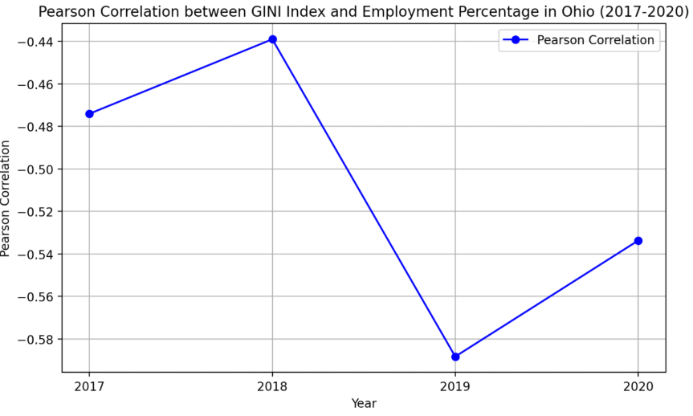
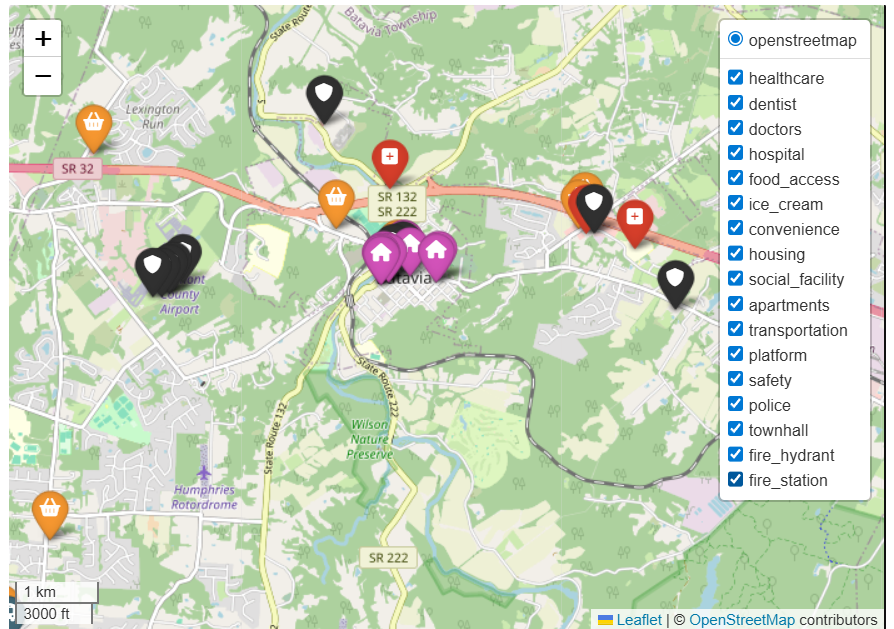

## Data Analytics Assistant

The **Data Analytics Assistant** is a chat application that helps analysts explore and analyze data. It uses a reasoning agent to interpret natural language queries, which can include selecting data from a database or fetching geographic data from Open Street Map. The assistant can perform statistical analyses, such as correlation, and generate visualizations using charts and maps.

### Quickstart
To start the assistant with minimal setup:

1. **Install prerequisites:** Docker, Docker Compose, and Git.

2. **Clone this repository:**
```
   git clone https://github.com/SocialHealthAI/Data-Analytics-Assistant.git
   cd (path to) Data-Analytics-Asssistant
```

3. **Set your keys:** Edit the `.env` file and add your `OPENAI_API_KEY`.

4. **Start the containers:**
```
   docker-compose up
```

5. Open the assistant in your browser:
```
   http://localhost:8052
```

For detailed instructions, see [installation.md](./documentation/installation.md).


### Features
The assistant can support the following data analysis steps:

1. **Data Exploration**: Start by exploring the available data to understand the structure and content. This might involve listing available tables and examining their schemas to identify relevant columns.

2. **Formulate Hypotheses**: Develop hypotheses about potential relationships or trends. For example, you might hypothesize that areas with higher education levels have better health outcomes.

3. **Data Querying**: Construct queries to extract relevant data. This could involve aggregating data by geographic regions or calculating statistical measures like correlations or trends over time.

4. **Visualization**: Use charts or maps to visualize the data, making it easier to identify patterns or anomalies.

5. **Interpretation**: Analyze the visualizations and data to draw conclusions about the relationships and trends.

The assistant is installed with demonstration data but can be used with your data.  The demo data is based on surveys on Social Determinants of Health from the [Agency for Healthcare Research and Quality](https://www.ahrq.gov/sdoh/data-analytics/sdoh-data.html) (AHRQ). You can [download data and codebooks](https://www.ahrq.gov/sdoh/data-analytics/sdoh-data.html#download) and documentation on [data sources](https://www.ahrq.gov/sites/default/files/wysiwyg/sdoh/SDOH-Data-Sources-Documentation-v1-Final.pdf) is available.

Here's an example data analysis chat with the assistant:

~~~
Do you have columns for GINI income inequality and the percentage of civilian labor force that are employed?
~~~
##### 💬 Final Answer
Yes, the database contains the following columns related to your query:

1. **Gini Index of Income Inequality**: This is available in the column `acs_gini_index` in the `sdoh_surveys` table.
2. **Percentage of Civilian Labor Force that is Employed**: This is available in the column `acs_pct_employed` in the `sdoh_surveys` table.

~~~
Compare columns ACS_GINI_INDEX and acs_pct_unemploy for 5 counties in the State of Ohio with the highest ACS_GINI_INDEX in year 2020
~~~
##### 💬 Final Answer
The five counties in Ohio with the highest ACS GINI Index in 2020 are:

1. **Cuyahoga County**: GINI Index of 0.51, Unemployment Rate of 7.45%
2. **Hamilton County**: GINI Index of 0.50, Unemployment Rate of 5.38%
3. **Adams County**: GINI Index of 0.50, Unemployment Rate of 6.60%
4. **Pike County**: GINI Index of 0.49, Unemployment Rate of 5.05%
5. **Athens County**: GINI Index of 0.48, Unemployment Rate of 5.84%
   
~~~
Do you have a statistical method to calculate correlation?
~~~
##### 💬 Final Answer
Yes, there are statistical methods available to calculate correlation in the database:

1. **Pearson Correlation Coefficient**:
       Description: Calculates the Pearson correlation coefficient between two float arrays, returning a value between -1 (perfect negative correlation) and 1 (perfect positive correlation).

2. **Pearson Correlation Coefficient with P-value**:
       Description: Calculates the Pearson correlation coefficient and the p-value, which tests the null hypothesis that the correlation is zero. It returns a table with `correlation` and `p_value` columns.

~~~
Show a line chart of the pearson correlation between the GINI Index and the Percentage of civilian labor force that is employed for the state of Ohio in the years 2017 to 2020
~~~
##### 💬 Final Answer

The line chart illustrates the Pearson correlation between the GINI Index and the percentage of the civilian labor force that is employed in Ohio from 2017 to 2020. The correlation values are negative, indicating an inverse relationship between the two variables over the given years.


The following is an example geographic analysis chat with the assistant.  Note that the demo analysis is configured for demonstrating Social Determinants of Health but can be configured for other geographic features.

~~~
Search for features centered on Batavia Ohio that are important to social determinants of health within 3 miles and present features in a map.
~~~

##### 💬 Final Answer
Map ready. The app will render the interactive map.


### Architecture
See [architecture.md](./documentation/architecture.md) for diagrams and component descriptions.

#### Usage
See [usage.md](./documentation/usage.md) for example prompts and considerations.

#### Installation
See [installation.md](./documentation/installation.md) for installation and configuration.